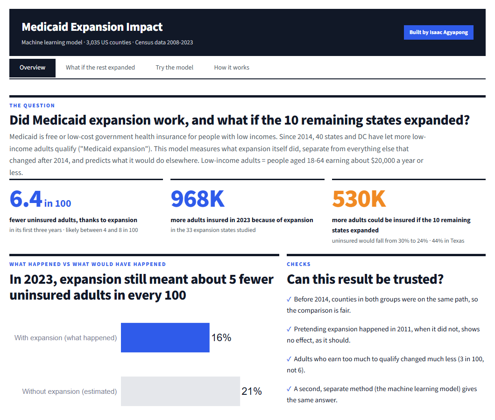
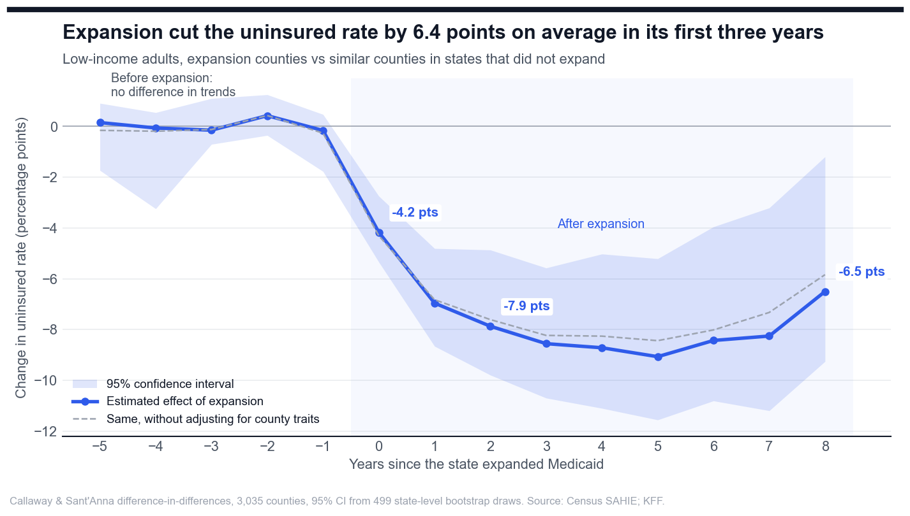
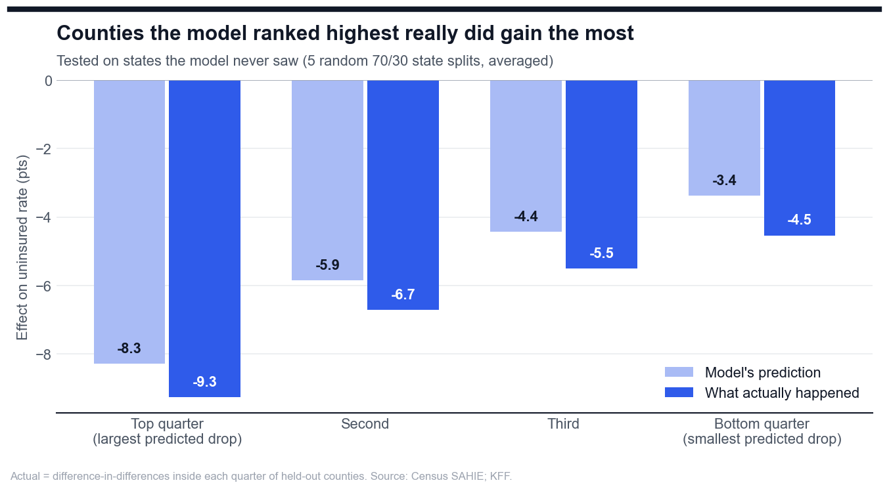
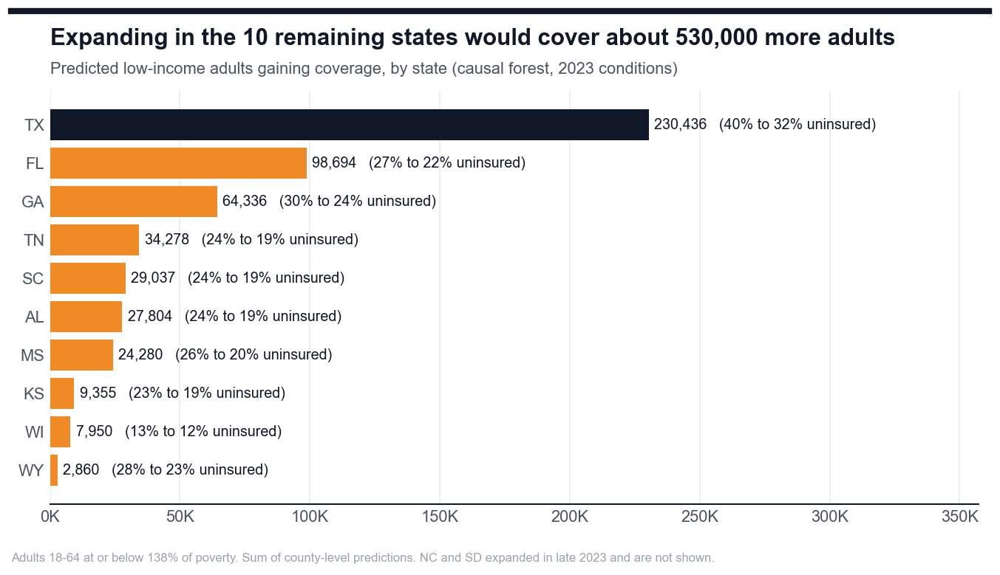
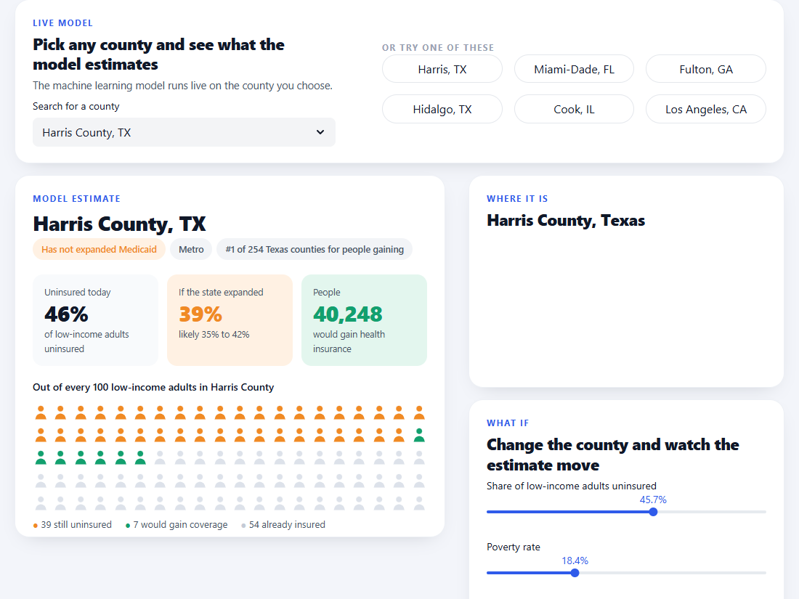
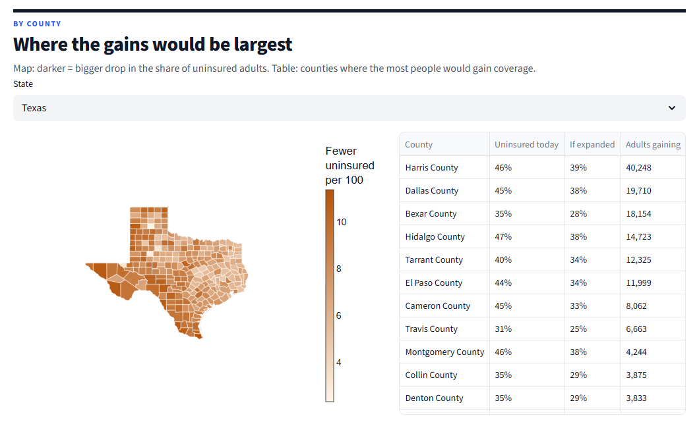

# Machine Learning Model for Medicaid Expansion Impact

Medicaid is free or low-cost health insurance from the government for people with low incomes. In 2014, states
were given the choice to let more low-income adults sign up for it. This is called Medicaid expansion. Most states
said yes. Ten states still have not.

After 2014, fewer people went without insurance everywhere, even in states that did not expand, because other
changes happened at the same time. So a simple before-and-after comparison gives the wrong answer. I built a model
to answer two questions properly:

1. How much did Medicaid expansion itself help?
2. If the ten remaining states expanded, how many more people would have health insurance?

### ▶ Live app: link added after deployment

## What I found

- Medicaid expansion meant about 6 fewer uninsured people in every 100 low-income adults in the first three years.
- Because of expansion, about 970,000 more low-income adults had health insurance in 2023.
- If the ten remaining states expanded, about 530,000 more adults would have health insurance. Almost half of them
  (230,000) would be in Texas.
- The places that gain the most are the ones where many people are poor and many are already uninsured.

"Low-income adults" here means people aged 18 to 64 who earn about $20,000 a year or less.

## How I worked it out

**Step 1: compare like with like.** For each county in a state that expanded, I found similar counties in states
that did not. I then compared how much the share of uninsured people changed in each group over the same years.
The extra drop in the expansion counties is the effect of Medicaid expansion.

**Step 2: train a machine learning model.** The model learned from about 1,700 counties that expanded between 2014
and 2021. It estimates how much each county gained, based on things like its poverty rate, income and how many people
were uninsured before. I then used it to estimate what each county in the ten remaining states would gain.

## Can the results be trusted?

I ran four checks. All four passed.

- Before 2014, both groups of counties were changing in the same way. This means the comparison is fair.
- I pretended expansion happened in 2011, when it did not. The model found no effect, which is correct.
- People who earn too much to qualify for Medicaid changed much less (about 3 in 100, not 6).
- The machine learning model and the step 1 comparison gave the same answer (6.5 and 6.4 in 100).

I also hid 30% of the states from the model and asked it to rank their counties. The counties it expected to gain
the most really did gain the most.

| | |
|---|---|
|  |  |

## The web app

The app has four pages:

| Page | What it does |
|---|---|
| Overview | The main results and the four checks |
| What if the rest expanded | How many people would gain insurance in each of the ten states, with a county map |
| Try the model | Pick any county. The model estimates how much expansion helped, or would help, there. Move the sliders to change the county and watch the answer change. |
| How it works | A short explanation of the method |

| | |
|---|---|
|  |  |

To run it on your own computer: `streamlit run app/app.py`

## What to keep in mind

- The data are Census estimates, so small counties are less exact than big ones.
- States chose whether to expand. If something else changed in those same states at the same time, it could affect
  the result.
- The predictions assume expansion would work in the remaining states the way it did in similar places. They are
  estimates, not promises.

## Data

US Census Bureau health insurance estimates for 3,035 counties from 2008 to 2023, and KFF records of when each
state expanded. The data was cleaned and checked in my companion project,
[Health Insurance Coverage Gap Analysis](https://github.com/Isaac-Agyapong/Health-Insurance-Coverage-Gap-Analysis),
which also has a Power BI dashboard.

## Tools used

Python (pandas, NumPy, scikit-learn, EconML causal forest, matplotlib, Plotly), causal inference
(difference-in-differences, Callaway and Sant'Anna method, placebo tests, bootstrap confidence intervals),
Streamlit for the web app, PostgreSQL for the source data.

## How to rebuild it

1. Run `pip install -r requirements.txt` (Python 3.13).
2. Run `python run_all.py --skip-data`. This rebuilds the results and charts from the data file saved in this
   project (about 5 minutes). No database is needed.

---

Built by Isaac Agyapong · [GitHub](https://github.com/Isaac-Agyapong)
