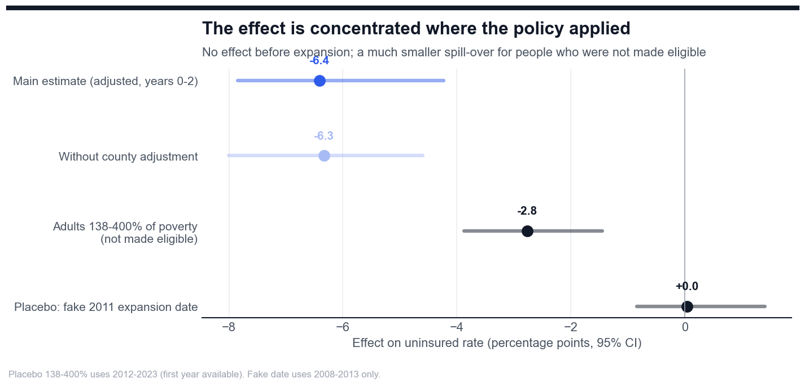
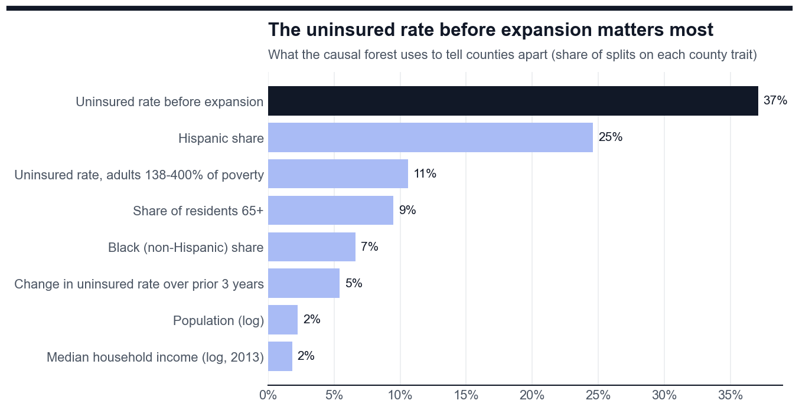

# Machine Learning Model for Medicaid Expansion Impact

**A model that measures how much Medicaid expansion itself reduced the number of low-income adults without health
insurance, estimates the effect for every US county, and predicts what would happen if the 10 remaining states
expanded. Built from real Census data on 3,035 counties, 2008-2023, with a live web app.**

> **In short:** Medicaid is free or low-cost government health insurance for people with low incomes. Since 2014,
> 40 states and DC have let more low-income adults qualify ("Medicaid expansion"); 10 states have not. The share of
> uninsured adults fell everywhere after 2014, so the hard question is how much of that drop the policy itself
> caused. I compared counties in states that expanded with similar counties in states that did not, then trained a
> machine learning model to estimate the effect for each county:
>
> * Expansion itself meant **about 6 fewer uninsured adults in every 100** in its first three years, and about
>   **970,000 more adults had health insurance in 2023** because of it.
> * The result passed **4 of 4 reliability checks** (for example, a fake expansion date shows no effect).
> * If the 10 remaining states expanded, the model predicts about **530,000 more adults** would be insured, **44% of
>   them in Texas**. Counties with more poverty and more uninsured people today would gain the most.
>
> The web app lets anyone pick a county and see what the model estimates.

### ▶ Live app: link added after deployment (Streamlit Community Cloud)

[](app/app.py)

**Companion project:** the data pipeline, SQL analysis and Power BI dashboard are in
[Medicaid_Expansion_Coverage_Analysis](https://github.com/Isaac-Agyapong/Medicaid_Expansion_Coverage_Analysis).

---

*The sections below go into technical detail.*

## The problem

The uninsured rate of low-income adults (18-64, at or below 138% of the federal poverty level) fell from 37% to 16%
in states that expanded Medicaid in 2014, and from 46% to 29% in states that did not. Part of both drops came from
changes that happened everywhere in 2014 (the ACA Marketplace, a growing economy). To measure what expansion itself
did, and to predict what it would do in states that have not expanded, two questions have to be answered:

1. **Causal effect:** how much lower is the uninsured rate because a state expanded?
2. **Heterogeneous effects:** which kinds of counties gain the most, and what would each county in the remaining
   states gain?

## Results

| Estimate (percentage points) | Value | 95% CI |
|---|---|---|
| **Effect of expansion, years 0-2 (adjusted for county traits)** | **-6.4** | -7.8 to -4.2 |
| Without adjustment | -6.3 | -8.0 to -4.6 |
| Adults 138-400% of poverty (not made eligible) | -2.8 | -3.9 to -1.4 |
| Placebo: fake expansion in 2011 (2008-2013 data only) | +0.0 | -0.8 to +1.4 |
| All post-expansion years: Callaway & Sant'Anna vs two-way fixed effects | -7.4 vs -7.1 | |
| Causal forest average effect on expansion counties | -6.5 | |
| Low-income adults insured in 2023 because of expansion | 968,000 | 237,000 to 1,286,000 |
| Adults who would gain coverage if the 10 remaining states expanded | 529,000 | |

* **Pre-trends are flat:** before expansion, expansion and comparison counties moved in parallel (average
  difference 0.1 points), which is the key condition for the design to be valid.
* **Two methods agree:** the causal forest's average effect (-6.46) matches difference-in-differences (-6.41).
* **Validated on unseen states:** over 5 random 70/30 splits of states, counties the model ranked in the top quarter
  really dropped 9.3 points vs 4.5 in the bottom quarter, in the predicted order; the ranking held in 4 of 5 splits.
* **Who gains most:** counties with the highest uninsured rates before expansion gained about twice as much (-8.2
  points) as those with the lowest (-4.0); high-poverty counties gained more than low-poverty ones (-7.1 vs -5.5).

| | |
|---|---|
|  |  |
|  |  |


## The web app

Four tabs, written for non-technical users (`app/app.py`, Streamlit):

* **Overview:** the three headline numbers, what happened vs what would have happened without expansion, and a
  "Can this result be trusted?" checklist.
* **What if the rest expanded:** predicted gains by state, and a county map and table for any of the 10 states.
* **Try the model:** pick any county; the causal forest runs live and estimates how much expansion helped (or would
  help) there. Sliders change the county's situation (uninsured rate, poverty, Hispanic share, income) to see how
  the estimate responds.
* **How it works:** plain explanation plus technical details.

| | |
|---|---|
|  |  |

## Methods

**Data (`Python/01_build_dataset.py`, `SQL/01_model_panel.sql`).** The county panel built by the analytics project in
PostgreSQL: Census Small Area Health Insurance Estimates for 3,035 counties in the balanced panel (present all 16
years), 2008-2023; KFF expansion dates (effective year = first year with at least 6 months of expansion); 2013 county
traits (poverty, income, race and ethnicity, age, population, USDA rurality). DE, DC, MA, NY and VT are excluded
because they covered low-income adults before 2014. Exported once to `Data/county_panel.csv.gz` (0.8 MB, committed),
so every later step runs without a database.

**Difference-in-differences (`Python/02_causal_effects.py`).** Callaway & Sant'Anna (2021), implemented directly in
NumPy: ATT(g, t) for every expansion cohort *g* and year *t*, comparing each cohort's change from *g-1* with the change
in never-expanded counties; pre-expansion cells use the previous year as base, so they test pre-trends. The main
estimate uses outcome-regression adjustment for 2013 county traits (Sant'Anna & Zhao 2020) and population weights.
Uncertainty: cluster bootstrap over states (the level at which the policy was decided), 499 draws. Checks: event-study
pre-trends, a group that should not respond (138-400% of poverty), a fake 2011 date, and the two-way fixed-effects
comparison.

**Causal forest (`Python/03_train_causal_forest.py`).** EconML `CausalForestDML`: double machine learning with
gradient-boosted outcome and treatment models, 2,000 honest trees. Training data are "stacked" event windows: each
expansion wave from 2014 to 2021 against never-expanded counties over the same years; outcome = mean uninsured rate in
years g to g+2 minus the rate in g-1. Effect modifiers are pre-expansion traits only; cohort dummies are controls.
Cross-fitting folds are grouped by state. Validation trains on 70% of states and checks, on the other 30%, that the
predicted ranking matches difference-in-differences inside each predicted quarter.

## Skills shown

* **Causal inference:** staggered difference-in-differences, event study, pre-trend tests, placebo tests,
  heterogeneous treatment effects, double machine learning.
* **Machine learning:** EconML causal forest, scikit-learn gradient boosting, grouped cross-fitting, held-out-group
  validation, confidence intervals for individual predictions.
* **Python:** pandas, NumPy, matplotlib, a Callaway & Sant'Anna estimator and cluster bootstrap written from scratch,
  notebook built with nbformat and executed with nbconvert.
* **Deployment:** Streamlit web app running the model live, Plotly county maps, pinned requirements for Streamlit
  Community Cloud.
* **SQL / PostgreSQL:** model dataset drawn from the analytics project's warehouse.

## Project structure

```
Data/county_panel.csv.gz        model dataset (3,035 counties x 16 years)
Data/results/                   effects by cohort and year, validation, county predictions
Python/
  01_build_dataset.py           export the panel from the analytics database
  02_causal_effects.py          difference-in-differences, placebos, bootstrap
  03_train_causal_forest.py     causal forest, validation, predictions, app files
  04_build_notebook.py          build and execute 04_model_results.ipynb
  viz_style.py                  chart style
SQL/01_model_panel.sql          the dataset query
models/                         fitted causal forest, results (JSON), app county table
app/app.py                      Streamlit web app (+ requirements.txt for deployment)
Image/                          charts and app screenshots
run_all.py                      rebuild everything in order
```

## How to reproduce

1. `pip install -r requirements.txt` (Python 3.13).
2. `python run_all.py --skip-data` to rebuild everything from the committed dataset (about 5 minutes). To rebuild the
   dataset too, first build the analytics project's database, then run `python run_all.py`.
3. `streamlit run app/app.py` to open the web app.

## Limitations

* Census county figures are model-based estimates with margins of error; every model weights counties by population.
* States chose whether to expand. The design removes fixed differences between counties and changes shared by all
  states, and pre-expansion trends match, but a state-specific change at the same time as expansion would bias the
  estimate.
* Census measures income over a year while Medicaid uses monthly income, so some adults above 138% of poverty were
  eligible part of the year; this is one reason that group shows a small effect.
* The 970,000 estimate covers the 33 expansion states in the balanced panel (not Connecticut or the 5 early-coverage
  states), so the national total is higher.
* Predictions assume expansion would work in the remaining states as it did in similar counties that expanded, under
  2023 conditions. They estimate the drop in the uninsured rate, not Medicaid enrollment.

---

Built by **Isaac Agyapong** · [GitHub](https://github.com/Isaac-Agyapong) · Data: US Census Bureau, KFF, USDA ERS
